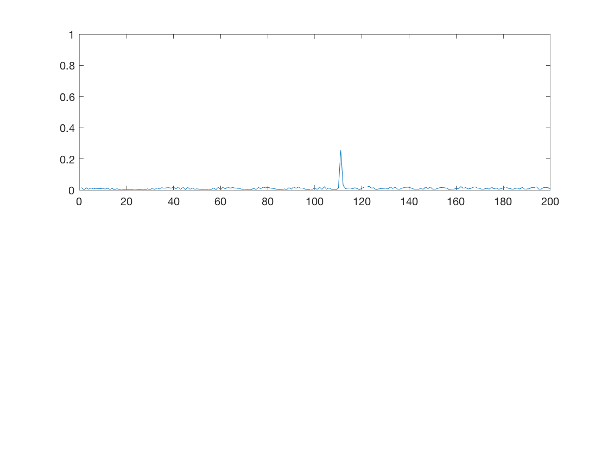
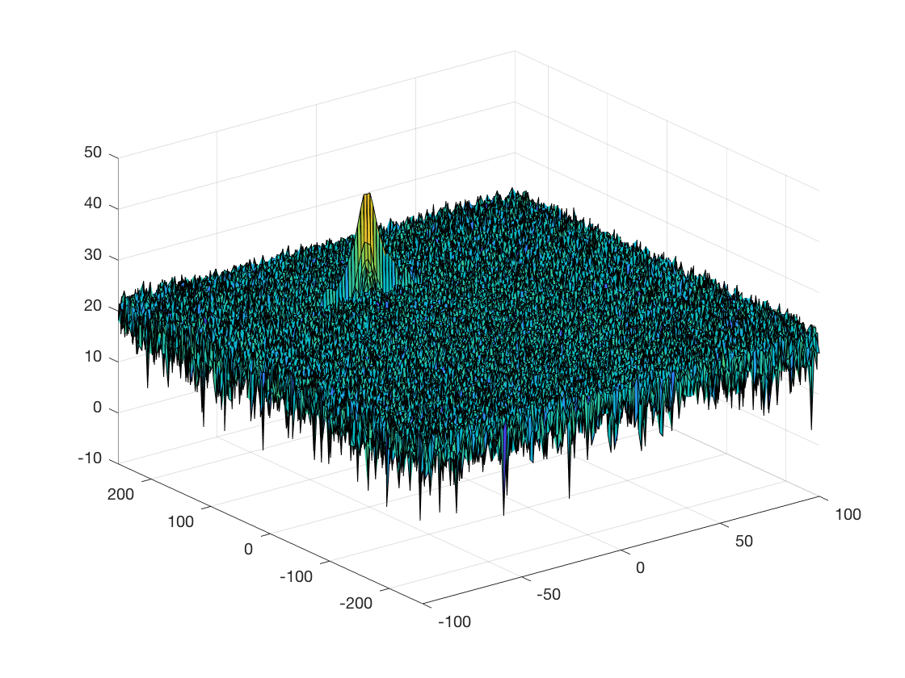
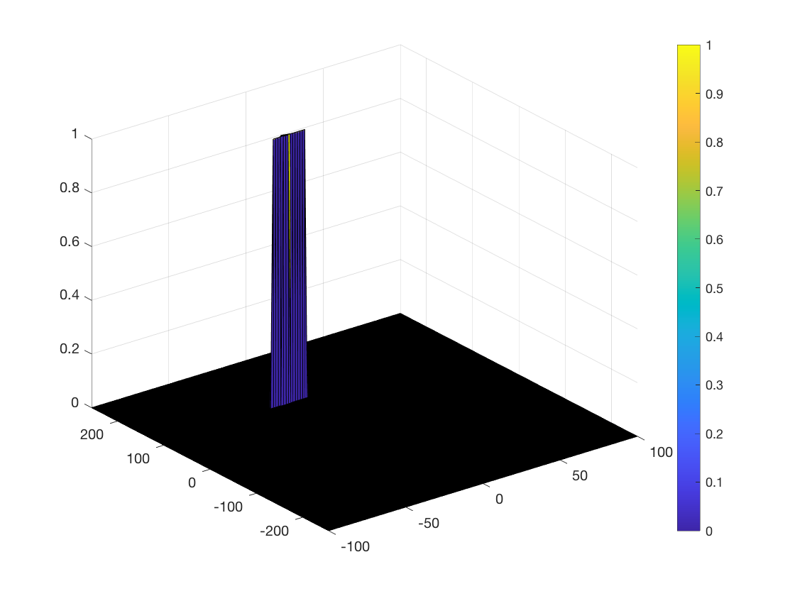
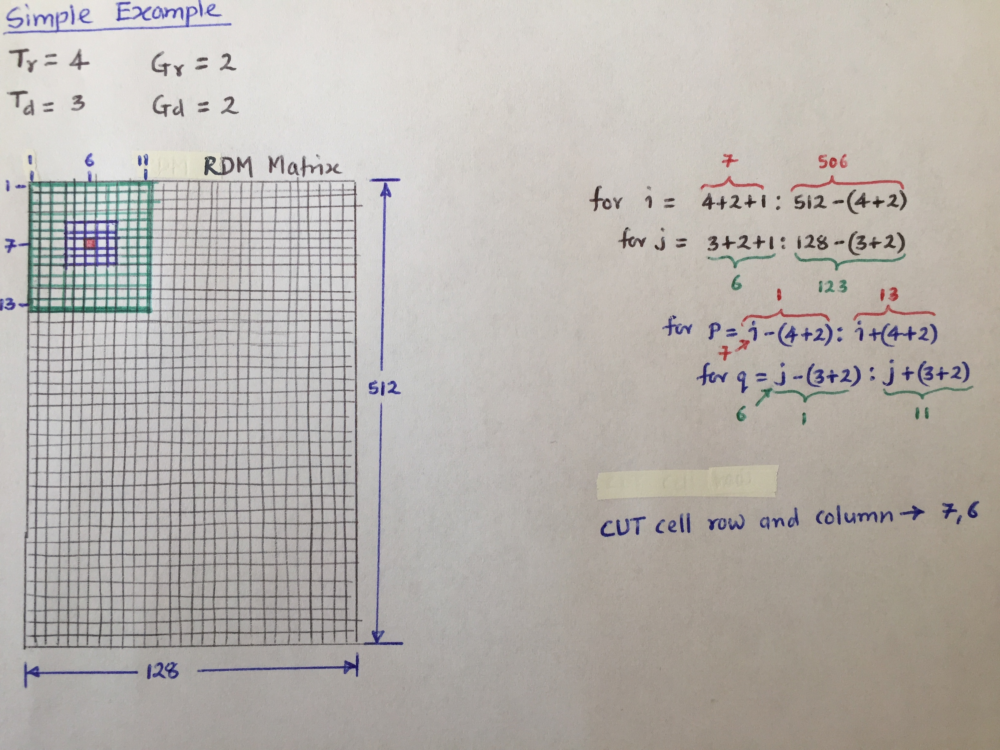
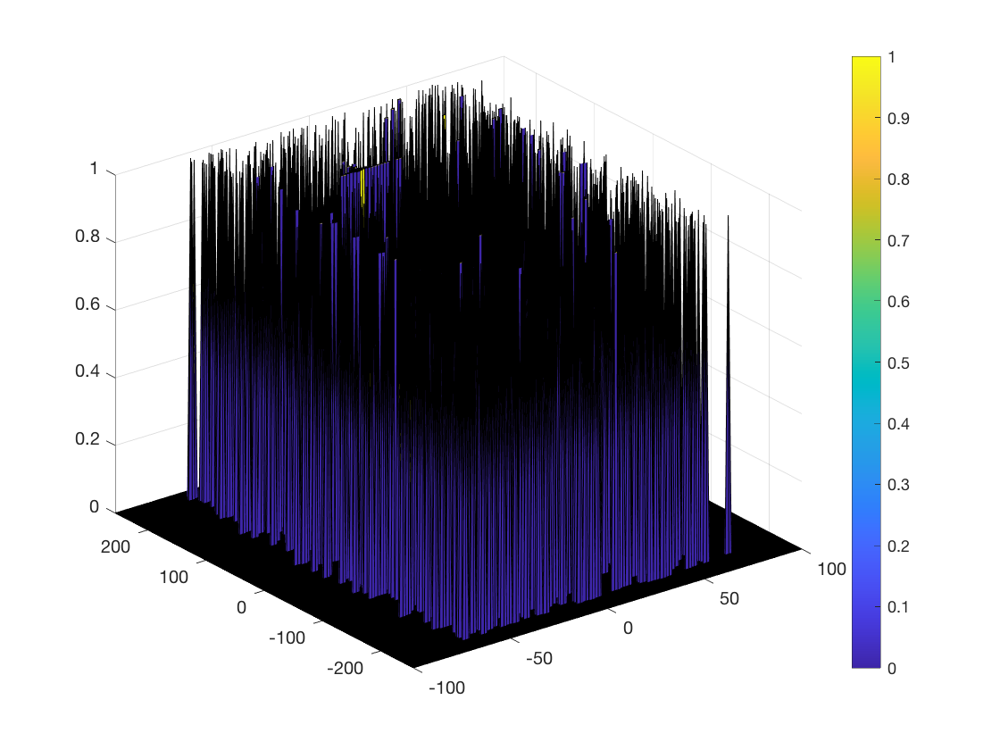
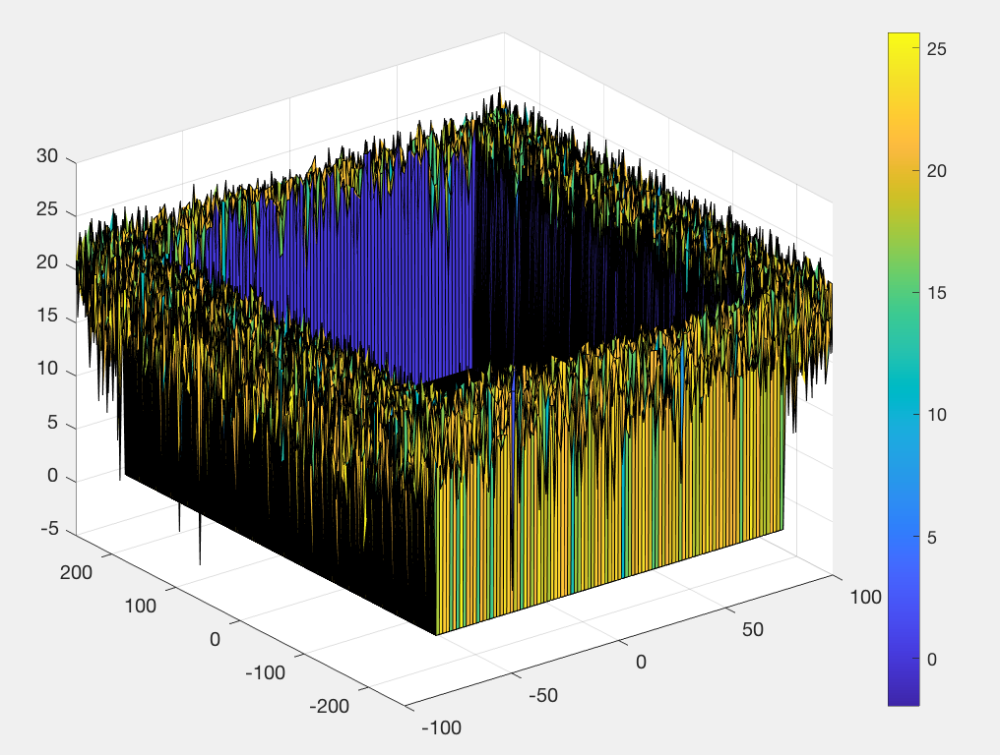

Radar Target Generation and Detection
---

### Output from running the MATLAB script





### Implementation steps for the 2D CFAR process



Implementation:

- Compute the range of locations of CUT cell (row and columns) in RDM matrix for looping over (outer double for loop).

```matlab
for i = Tr+Gr+1:M-(Tr+Gr)
    for j = Td+Gd+1:Nd-(Td+Gd)
```

- Compute the range of indices of Training cells (including Guard cells and CUT cell) in RDM matrix for looping over (inner double for loop).

```matlab
for p = i-(Tr+Gr):i+(Tr+Gr)
    for q = j-(Td+Gd):j+(Td+Gd)
```

- Check if indices of cell belong to only Training cells, i.e. excluding Guard cells and CUT cell. Then convert the respective Training cell value from logarithmic to linear using `db2pow` function and add to zero initialized vector.

```matlab
if abs(i-p) || abs(j-q) 
   noise_level = noise_level + db2pow(RDM(p,q));
end
```

- After the inner for loop finishes executing, compute the average of the summed values for all of the training cells used. Then convert the average value back to logarithimic using `pow2db` function. Then add offset to the converted average value to determine threshold.

- Extract CUT cell value and compare the signal under CUT with computed threshold. If the CUT level > threshold assign it a value of 1, else equate it to 0

```matlab
% Signal under CUT
CUT = RDM(i,j);
        
% If the CUT level > threshold assign it a value of 1, else equate it to 0
if CUT > threshold
   RDM(i,j) = 1;
else
   RDM(i,j) = 0;
end 
```

### Selection of Training, Guard cells and offset

Number of Training Cells in both the dimensions, and the number of Guard Cells in both dimensions around the Cell under test (CUT) was selected based on the *Project Overview Video by the instructor*, however the values are slightly modified. 

Offset was selected based on visualizing the results. I tried 5, 6, 7 as offset values, since these values were low a lot of clutter was not removed. The figure below shows the result when `offset = 5` is used.



I then used offset values greater than 8 and over and it seemed to produce result similar to the results shown in *Project Overview Video by the instructor*

### Steps taken to suppress the non-thresholded cells at the edges

Without supression the non-thresholded cells at the edges were producing wrong result as shown in the figure below:



To supress the the non-thresholded cells at the edges I looped over all rows and columns of RDM matrix (after CA CFAR) and checked if RDM matrix cell value is not 0 or 1, if this condition is true I then replaced respective cell value in RDM matrix as 0.

```matlab
for i = 1:M
    for j = 1:Nd
        % Outer cells of RDM matrix has values other than 0 or 1 so set
        % them to 0
        if RDM(i,j) ~= 0 && RDM(i,j) ~= 1
            RDM(i,j) = 0;
        end
    end
end
```

